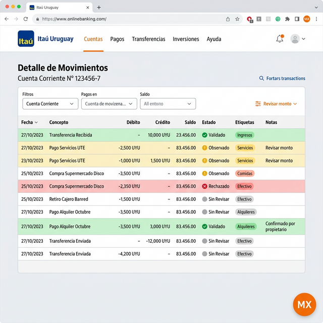
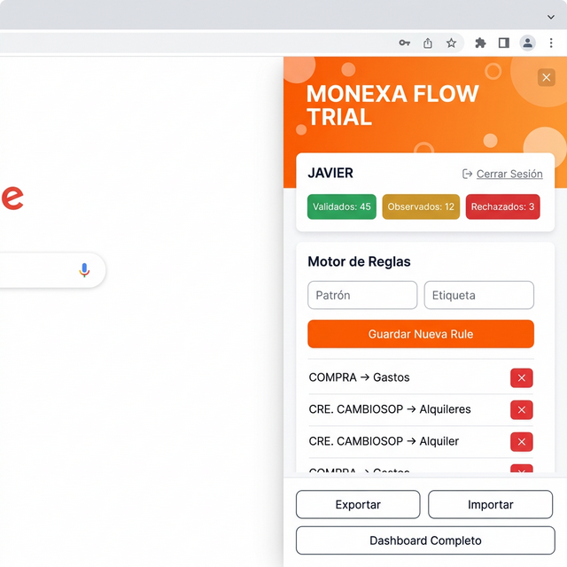
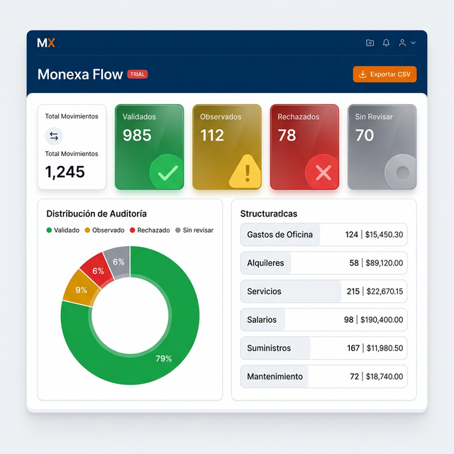
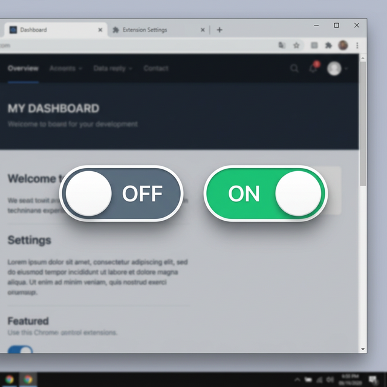

# Monexa Flow — Guía Completa del Sistema

> Sistema de Auditoría Bancaria Profesional para Itaú Uruguay

---

## 1. 🔍 Escáner Automático de Movimientos

El corazón de Monexa. Se activa automáticamente al ingresar a la página del banco Itaú y **escanea todas las filas** de la tabla de movimientos inyectando columnas de auditoría.

**Capacidades:**
- Detecta automáticamente cada movimiento (fecha, concepto, débito, crédito, saldo)
- Inyecta columnas extras: **Etiqueta**, **Nota** y **Estado** (semáforo visual)
- Resalta cada fila con color de fondo según su estado de revisión
- Detecta el número de cuenta activa y lo muestra en un chip sobre el botón flotante
- Usa un **MutationObserver** para re-escanear cuando el banco carga nuevos datos dinámicamente
- **Filtra cotizaciones de divisas** (U$S, Pizarra, Brou) para mantener limpia la auditoría

---

## 2. 🚦 Sistema de Estados (Semáforo de Auditoría)

Cada movimiento puede ciclar entre **4 estados** haciendo click en el botón de estado:

| Estado | Color | Icono | Significado |
|---|---|---|---|
| **Sin Revisar** | Gris `#94a3b8` | ○ | El movimiento no fue tocado aún |
| **Validado** | Verde `#10b981` | ✓ | Revisado y aprobado por el auditor |
| **Observado** | Ámbar `#f59e0b` | ! | Requiere atención o seguimiento |
| **Rechazado** | Rojo `#e11d48` | × | Movimiento rechazado o irregular |

**Ciclo:** `Sin Revisar → Validado → Observado → Rechazado → Sin Revisar`

---

## 3. 🧠 Motor de Reglas (Auto-Match)

Permite definir reglas de texto para que los movimientos **se clasifiquen automáticamente** al ser escaneados.

**Capacidades:**
- **Patrón + Etiqueta**: Si el concepto del banco contiene el patrón, se le asigna la etiqueta y se marca como "Validado" automáticamente
- **Limpieza inteligente**: Elimina caracteres invisibles (`&nbsp;`, dobles espacios) tanto del patrón como del concepto del banco
- **Aplicación retroactiva**: Al agregar una regla nueva, se aplica automáticamente a **todos los registros pasados** que estén "Sin Revisar" y sin etiqueta
- **Exportar / Importar**: Las reglas se pueden exportar e importar entre instalaciones
- **Eliminar reglas**: Cada regla tiene un botón ✕ para borrarla

**Ejemplo de reglas:**
- `COMPRA` → *Gastos*
- `DEB. CAMBIOS` → *Gastos x Transferencia*
- `CRE. CAMBIOSOP` → *Alquileres*

---

## 4. 🔎 Buscador en Tiempo Real

Motor de búsqueda integrado que filtra por **concepto**, **nota** o **etiqueta** en todas las transacciones almacenadas. Los resultados aparecen al instante mientras se escribe.

---

## 5. 📋 Panel de Control Lateral

El panel se abre al hacer click en el botón flotante **MX** (naranja, esquina inferior derecha).

**Secciones del panel:**
- **Header**: Muestra "MONEXA FLOW **TRIAL**" con gradiente naranja
- **Información de sesión**: Nombre del auditor activo + opción de *Cerrar Sesión*
- **Estadísticas rápidas**: 3 cuadros de colores (Validados / Observados / Rechazados)
- **Motor de Reglas**: Formulario para crear y gestionar reglas
- **Buscador**: Campo de búsqueda de transacciones
- **Acciones**: Botones de Exportar Excel, Exportar Reglas, Importar, y abrir Dashboard

---

## 6. 📊 Dashboard Analítico (Pantalla Completa)

Dashboard premium en pantalla completa con diseño glassmorphism.

**Secciones:**

### KPIs (5 tarjetas)
- **Total Movimientos** — Cantidad total de registros
- **Validados** (verde) — Movimientos aprobados
- **Observados** (ámbar) — Requieren atención
- **Rechazados** (rojo) — Irregularidades detectadas
- **Sin Revisar** (gris) — Pendientes de auditoría

### Gráfico de Dona
Distribución visual de los estados de auditoría.

### Resumen por Etiqueta
Lista de todas las etiquetas con:
- Cantidad de movimientos por etiqueta
- **Suma monetaria** (créditos − débitos) con formato `$ 1.500,50`
- Color condicional: verde si es positiva, rojo si es negativa

### Tabla de Movimientos
Tabla completa y filtrable con columnas: Fecha, Concepto, Débito, Crédito, Saldo, Etiqueta, Nota, Estado, Auditor, Timestamp. Con header sticky y ordenamiento por click.

### Filtros Avanzados
- Filtro por estado (Todos / Validado / Observado / Rechazado / Sin Revisar)
- Filtro por etiqueta (dropdown dinámico)
- Búsqueda en texto libre
- Ordenamiento ascendente/descendente por cualquier columna

### Registro de Actividad (Logs)
Visor de logs del sistema con filtrado por nivel (INFO / WARN / ERROR).

### Exportar CSV
Botón para descargar todos los datos filtrados como archivo CSV.

---

## 7. 📤 Exportación e Importación

### Exportar Auditoría (Excel/HTML)
- Genera un archivo `.xls` con formato profesional
- Incluye: encabezado con auditor, fecha, hash de integridad
- Filas coloreadas según el estado de auditoría
- Compatible con Excel, Google Sheets y LibreOffice

### Exportar Reglas
- Exporta las reglas como archivo `.csv` descargable

### Importar
- Importa archivos `.csv` con formato `Patrón,Etiqueta` para reglas
- Importa transacciones con formato estándar

---

## 8. 🔐 Gestión de Sesión

- **Onboarding**: Pantalla de bienvenida para ingresar el nombre del auditor
- **Cerrar Sesión**: Borra las credenciales del auditor y recarga la página
- **Cambiar Usuario**: Se puede cerrar sesión y volver a ingresar con otro nombre

---

## 9. 🔄 Slider ON/OFF (Activar/Desactivar)

Botón flotante estilo iOS para activar o desactivar todo el sistema de auditoría. Cuando está desactivado, aparece un slider gris con "OFF"; al hacer click, se desliza a verde "ON" con una animación suave y recarga la página.

---

## 10. ☁️ Almacenamiento Híbrido

| Tipo de Dato | Almacenamiento | Ventaja |
|---|---|---|
| Reglas | `chrome.storage.sync` | Se sincronizan entre PCs |
| Configuración | `chrome.storage.sync` | Se sincronizan entre PCs |
| Transacciones | `chrome.storage.local` | Sin límite de espacio |
| Logs | `chrome.storage.local` | Sin límite de espacio |

---

## 11. 🏗️ Arquitectura Modular

El sistema está compuesto por **9 módulos** independientes:

| Módulo | Archivo | Función |
|---|---|---|
| Config | `00_config.js` | Constantes, paleta, estados |
| DB Engine | `01_db.js` | Motor de almacenamiento híbrido |
| Logger | `02_logger.js` | Sistema de logs |
| System Control | `03_system.js` | ON/OFF del sistema |
| Data Core | `04_data.js` | Fingerprinting y sanitización |
| File System | `05_filesystem.js` | Import/Export |
| Scanner | `06_scanner.js` | Escaneo del DOM bancario |
| Search | `07_search.js` | Motor de búsqueda |
| UI Factory | `08_ui.js` | Toda la interfaz visual |
| Boot | `09_boot.js` | Arranque del sistema |
